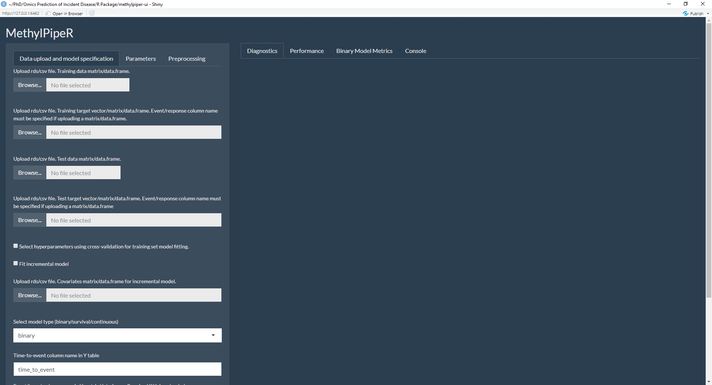
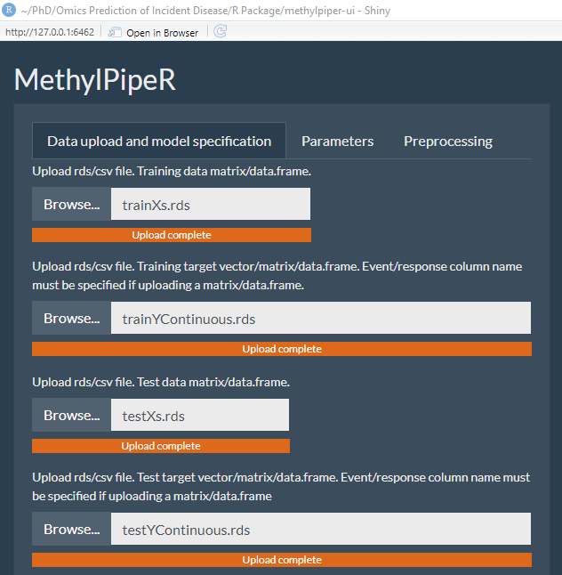
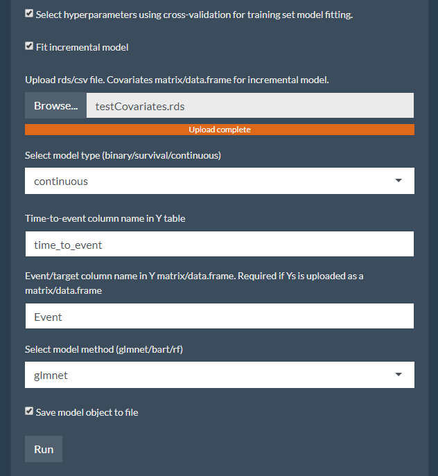

# MethylPipeR-UI
MethylPipeR-UI is a Shiny app that provides all the functionality of MethylPipeR, without having to write a single line of code!
This guide describes the steps required to run a basic pipeline experiment.

## Installation
To install MethylPipeR-UI, use the following in R:
```r
remotes::install_github('marioni-group/methylpiper-ui')
```

## Initial setup
In future versions, this will be changed to use a config file, but for now a log directory needs to be specified.
This can be done by entering the path of your desired log folder in the following line:
```r
sessionLogFolder <- 'C:/Users/s2092119/Documents/PhD/Omics Prediction of Incident Disease/R Package/MethylPipeR-UI_logs/' # Replace this with your log folder path
```
NOTE: Make sure to end the path with a '/'

## Launching MethylPipeR-UI
The Shiny app can be launched by running the following from within R
```r
library(shiny)
runApp('/path/to/methylpiper-ui/folder') # Replace this argument with the path to the methylpiper-ui folder (where app.R is located)
```

## Running a pipeline experiment
### Initial launch
When the app is first launched, you will be greeted with the following page:



### Data upload
Files for the training/test data/target can be uploaded by clicking the 'Browse...' buttons and navigating to the corresponding files.
These should consist of .csvs or .rds files containing an R matrix/data.frame.



For data files, columns should correspond to features (e.g. CpG sites in the case of DNA methylation array data). Rows should correspond to individuals in the dataset.
For target files, columns should correspond to:
* A response variable. Default column name is 'Event' but a different column name can be specified in a later menu.
* A time-to-event variable if required. Default column name is 'time_to_event' but a different column name can be specified in a later menu.
For training and test sets, rows in the data should correspond to the same rows in the target.

### Incremental modelling + model specification
Additional options in this tab include:
* Hyperparameter selection using k-fold cross-validation (currently defaults to k=3)
* Incremental modelling - the following two models are fit to the test set:
    * Null model: covariates only.
    * Full model: covariates and the score generated from the model that was fit to the training set.
* Model type - continuous, binary or survival.
* Custom time-to-event column name (if not 'time_to_event').
* Custom response column name (if not 'Event').
* Model method - current options are glmnet, BART and random forest.
* Save model - if selected, MethylPipeR-UI will automatically save the fitted model.



Click 'Run' to start model fitting.